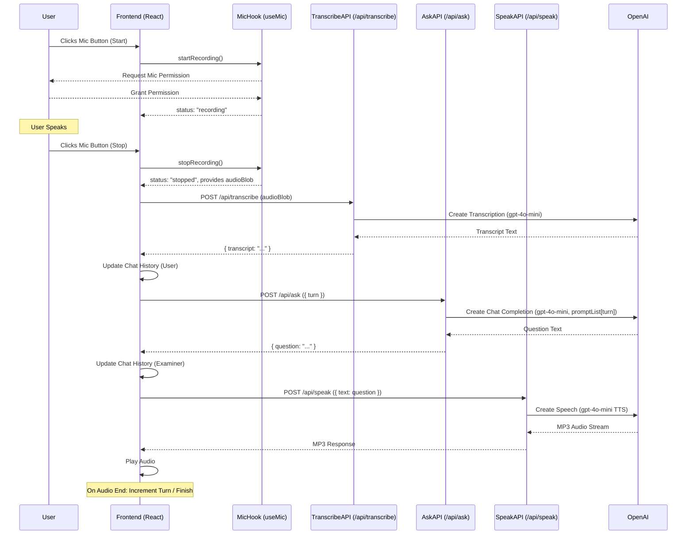
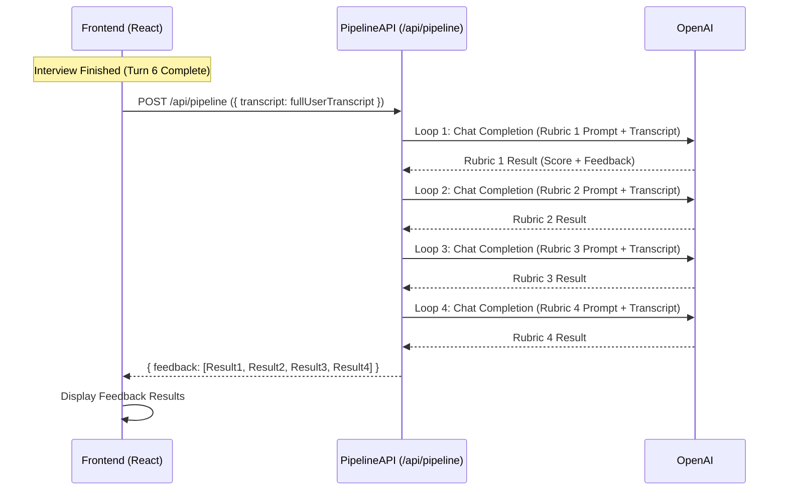

# IELTS Speaking Mock Test App - Architecture

This document outlines the architecture of the IELTS Speaking Mock Test application.

## Overview

The application is a Next.js web app that allows users to practice IELTS Speaking Part 1 with an AI examiner. It utilizes several OpenAI models for different parts of the interaction flow.

## Core Components

1.  **Frontend (React / Next.js):**
    *   Located primarily in `app/page.tsx`.
    *   Uses React state (`useState`) and effects (`useEffect`) to manage the application state machine (`idle`, `recording`, `transcribing`, etc.).
    *   Uses a custom hook `app/hooks/useMic.ts` to interact with the browser's `MediaRecorder` API for audio capture (outputting WebM blobs).
    *   Handles user interaction (mic button press).
    *   Displays chat history (user transcripts and examiner questions).
    *   Plays back examiner audio using a standard HTML `<audio>` element.
    *   Displays final feedback results.
    *   Communicates with backend API routes.

2.  **Backend API Routes (Next.js):**
    *   Built using Next.js API Routes (`app/api/.../route.ts`).
    *   Serve as intermediaries between the frontend and the OpenAI API.
    *   Use the official `openai` Node.js library initialized in `lib/openai.ts`.
    *   **`/api/transcribe`**: Receives audio Blob, calls OpenAI STT (`gpt-4o-mini`), returns transcript text.
    *   **`/api/ask`**: Receives turn number, retrieves a specific prompt from `lib/promptList.ts`, calls OpenAI Chat Completions (`gpt-4o-mini`), returns examiner question text.
    *   **`/api/speak`**: Receives text, calls OpenAI TTS (`gpt-4o-mini`, voice "alloy"), streams back MP3 audio.
    *   **`/api/pipeline`**: Receives full user transcript, iterates through rubric prompts in `lib/rubricPrompts.ts`, calls OpenAI Chat Completions (`gpt-4o-mini`) for each, parses results, returns structured feedback array.

3.  **OpenAI API:**
    *   Provides the core AI functionalities:
        *   Speech-to-Text (`gpt-4o-mini` transcription)
        *   Chat Completion (`gpt-4o-mini` for question generation and rubric evaluation)
        *   Text-to-Speech (`gpt-4o-mini` TTS)

4.  **Configuration & Prompts:**
    *   `lib/openai.ts`: Initializes the OpenAI client using the `OPENAI_API_KEY` environment variable.
    *   `lib/promptList.ts`: Contains the specific, structured prompts used to make the LLM generate the exact sequence of examiner questions for the 6 turns.
    *   `lib/rubricPrompts.ts`: Contains the prompts used to evaluate the user's transcript against the four IELTS criteria (Fluency & Coherence, Lexical Resource, Grammatical Range & Accuracy, Pronunciation - text-inferred).

## Data Flow (Single Turn)

## Data Flow (Feedback Pipeline - After Turn 6)

This architecture prioritizes using standard browser APIs and Next.js features, minimizing external dependencies beyond the OpenAI SDK. 