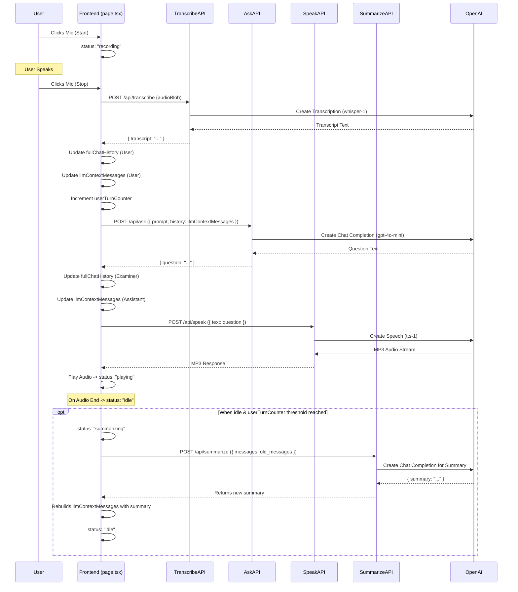
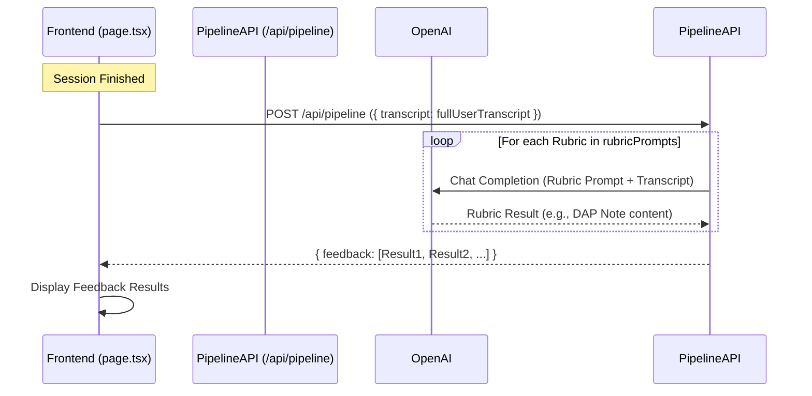

# Therapy Chatbot Application - Architecture

This document outlines the architecture of the Therapy Chatbot application, adapted from the original "IELTS Speaking Mock Test" project.

## Overview

The application is a Next.js web app that provides a conversational AI therapist for users. It leverages a sophisticated in-session memory system, combining a short-term buffer with long-term summarization to maintain contextually coherent and natural conversation. The entire interaction is guided by a single system prompt that defines the AI's therapeutic persona, powered by OpenAI models.

## Core Components

1.  **Frontend (React / Next.js):**
    *   Located in `app/page.tsx`.
    *   Manages the application state machine (`idle`, `recording`, `transcribing`, `summarizing`, `asking`, etc.).
    *   Uses a custom hook `app/hooks/useMic.ts` to interact with the browser's `MediaRecorder` API.
    *   Maintains two distinct chat histories:
        *   `fullChatHistory`: A complete, unabridged log of the user-examiner conversation, used for UI display and final pipeline processing.
        *   `llmContextMessages`: A separate, dynamic array of messages sent to the `/api/ask` endpoint. This history is periodically summarized to manage context length.
    *   Plays back therapist audio using a standard HTML `<audio>` element.

2.  **Backend API Routes (Next.js):**
    *   Built using Next.js API Routes (`app/api/.../route.ts`).
    *   Serve as stateless intermediaries between the frontend and the OpenAI API.
    *   Use the official `openai` Node.js library initialized in `lib/openai.ts`.
    *   **`/api/transcribe`**: Receives an audio Blob, calls OpenAI's Whisper model (`whisper-1`), and returns the transcript text.
    *   **`/api/summarize`**: Receives a chunk of the conversation history, calls OpenAI Chat Completions (`gpt-4o-mini`) with a specialized summarization prompt, and returns a concise summary. This is the core of the long-term memory system.
    *   **`/api/ask`**: Receives the summarized conversation context (`llmContextMessages`). It sends this context to OpenAI Chat Completions (`gpt-4o-mini`) to dynamically generate the next therapist question based on the preceding dialogue.
    *   **`/api/speak`**: Receives text, calls OpenAI TTS (`tts-1`, voice "alloy"), and streams back MP3 audio.
    *   **`/api/pipeline`**: At the end of a session, this receives the full user transcript, iterates through rubric prompts in `lib/rubricPrompts.ts` (e.g., to generate a clinical DAP note), calls OpenAI Chat Completions for each, and returns structured results.

3.  **OpenAI API:**
    *   Provides the core AI functionalities:
        *   Speech-to-Text (`whisper-1` transcription)
        *   Chat Completion (`gpt-4o-mini` for dynamic question generation, summarization, and final analysis)
        *   Text-to-Speech (`tts-1` TTS)

4.  **Configuration & Prompts:**
    *   `lib/openai.ts`: Initializes the OpenAI client using the `OPENAI_API_KEY` environment variable.
    *   `lib/singlePrompt.ts`: Contains the single, high-level system prompt that defines the AI therapist's role, task, and constraints for the entire conversation.
    *   `lib/rubricPrompts.ts`: Contains the prompts used to process the user's transcript *after* the session, such as generating a "DAP Note".
    *   `lib/interviewPrompts.ts`: **(DEPRECATED)** Previously contained a scripted, turn-by-turn interview. It is no longer in use.

## Data Flow (Single Turn & Summarization)

The application uses a reactive flow for conversation and an asynchronous process for summarization to ensure the UI is never blocked.

## Data Flow (End-of-Session Processing)

This architecture enables a flexible and intelligent conversation flow by using a summarized dialogue context, moving away from a rigid, pre-scripted interview and creating a more robust conversational memory. 