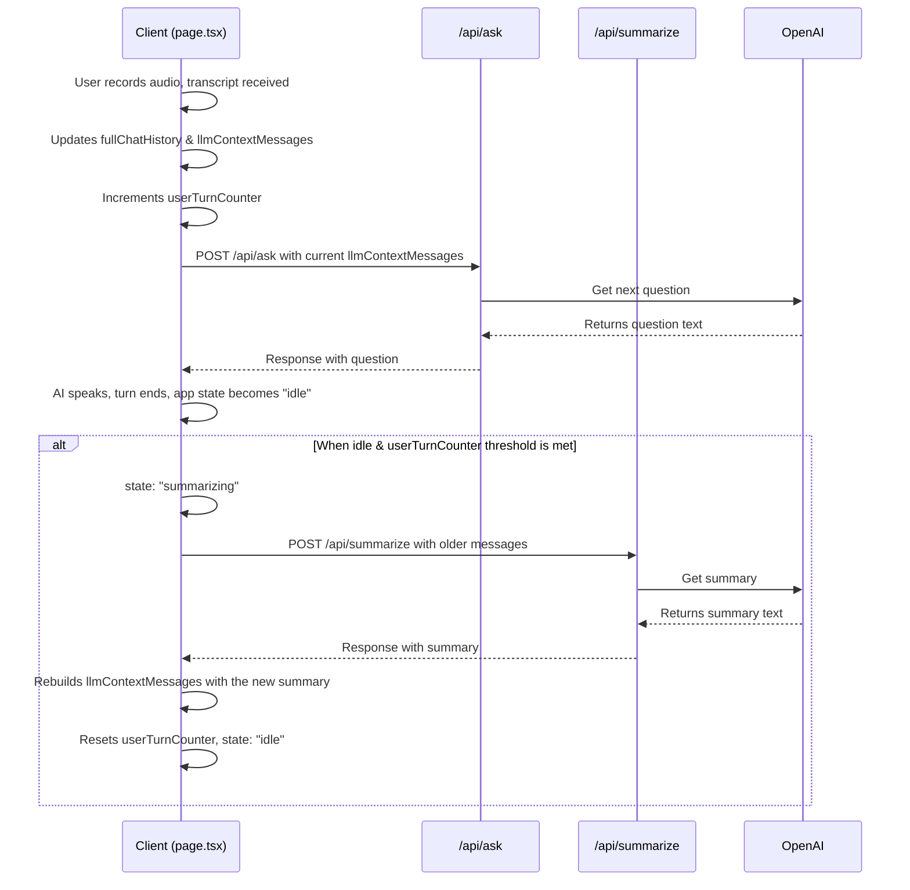

# The Implemented Memory System: A Deep Dive

This document provides a comprehensive analysis of the application's memory system as implemented. It is designed to maintain conversational context efficiently by using a client-side orchestration strategy that combines a full, permanent transcript with a dynamic, summarized context for the AI.

This system intentionally avoids third-party libraries in favor of a transparent, custom implementation controlled by the frontend.

---

## 1. High-Level Architecture: Smart Client, Stateless Server

The memory system is built on a "Smart Client, Stateless Server" principle:

-   **Smart Client (`app/page.tsx`):** The user's browser is the single source of truth. It holds and manages the entire application state, including:
    -   `fullChatHistory`: The complete, unabridged transcript of the conversation, used for UI display and final analysis.
    -   `llmContextMessages`: A separate, dynamically managed array of messages that is sent to the AI for generating the next turn. This context is periodically rebuilt with a summary.
    -   `userTurnCounter`: A simple counter that tracks the number of user turns to determine when to trigger a summarization.
-   **Stateless Server (API Routes):** The backend APIs are stateless. They retain no memory of past interactions. Every API call from the client contains all the necessary context for the server to perform its task. The key APIs involved are `/api/ask` and `/api/summarize`.

---

## 2. The Two Tiers of History

The system operates on two distinct history arrays managed entirely on the client.

### Tier 1: The Permanent `fullChatHistory`

This is the complete, unaltered record of the conversation.

-   **What it is:** An array of `ChatMessage` objects (`{ role: 'user' | 'examiner', content: '...' }`).
-   **How it works:** Every time a user finishes speaking and a transcript is received, it's added here. Every time the AI responds, its message is added here. This log grows throughout the session and is never modified.
-   **Purpose:**
    1.  To provide a complete, human-readable transcript for the user to view.
    2.  To provide the full, unaltered user transcript to the `/api/pipeline` endpoint for the final, end-of-session analysis (e.g., DAP Note generation).

### Tier 2: The Dynamic `llmContextMessages`

This is the AI's working memory, which is periodically condensed to stay within context limits.

-   **What it is:** An array of `OpenAI.Chat.ChatCompletionMessageParam` objects, formatted for the OpenAI API.
-   **How it works:** This history also grows with each turn, but it is periodically and completely rebuilt. When the `userTurnCounter` reaches a specific interval (`SUMMARIZATION_INTERVAL_USER_TURNS`), the client triggers the summarization process.
-   **The Trigger:** The summarization task is triggered by the **client** when `userTurnCounter` is a multiple of `SUMMARIZATION_INTERVAL_USER_TURNS` and the application is in an `idle` state.
-   **The Process:**
    1.  The client identifies a recent "buffer" of messages to keep (`MESSAGES_TO_KEEP_USER_TURNS`).
    2.  The messages *before* this buffer are sent to the `/api/summarize` endpoint.
    3.  The `/api/summarize` endpoint returns a single summary string.
    4.  The client then completely rebuilds `llmContextMessages` in the following order:
        - The main system prompt (therapist persona).
        - A new message with `{ role: 'assistant', content: "I've summarized our previous exchanges for context: <summary_text>" }` containing the summary.
        - The "buffer" of recent messages that were kept.
-   **Purpose:** To provide the `/api/ask` endpoint with enough context to generate a relevant response while preventing the context window from growing indefinitely.

---

## 3. The Summarization Prompt & API

The effectiveness of the long-term memory depends on the `/api/summarize` endpoint.

**API Route:** `app/api/summarize/route.ts`
**Prompt:** The system prompt used for the summarization task is located directly within this file.

```
You are an AI assistant tasked with summarizing a conversation between a user and an examiner.
Your goal is to create a concise, factual summary that captures the main topics discussed and key points made by both participants.
This summary will be used to provide context to a language model for future turns in the conversation.
Focus on retaining important details relevant to the ongoing dialogue.
The summary should be a continuous paragraph, starting directly with the summary content.
Do NOT include any introductory phrases like "Here is a summary:" or "The conversation discussed:".
Do NOT add any conversational elements or questions. Just the summary.

Example summary: "The user discussed their hobbies, mentioning a passion for painting and how it helps them relax. The examiner asked about their inspiration and the user shared details about nature as a muse."
```

---

## 4. Code Implementation & Data Flow

The logic is orchestrated by the client in `app/page.tsx`, primarily using `useEffect` hooks.

**Client-Side Summarization Trigger Logic (`app/page.tsx`):**

This snippet shows the `useEffect` hook that watches for the right conditions to initiate summarization.

```typescript
//...
const MESSAGES_TO_KEEP_USER_TURNS = 3;
const SUMMARIZATION_INTERVAL_USER_TURNS = 4;
//...

useEffect(() => {
  if (userTurnCounter > 0 && userTurnCounter % SUMMARIZATION_INTERVAL_USER_TURNS === 0 && appState === 'idle') {
    
    const currentLlmMessages = llmContextMessagesRef.current;

    // Filter out system/summary messages to get pure conversation
    const conversationalMessagesOnly = currentLlmMessages.filter(msg =>
      msg.role === 'user' || (msg.role === 'assistant' && typeof msg.content === 'string' && !msg.content.startsWith("I've summarized our previous exchanges for context:"))
    );

    const messagesToKeepCount = MESSAGES_TO_KEEP_USER_TURNS * 2;

    if (conversationalMessagesOnly.length > messagesToKeepCount) {
      const messagesToSummarize = conversationalMessagesOnly.slice(0, -messagesToKeepCount);
      const messagesToKeep = conversationalMessagesOnly.slice(-messagesToKeepCount);

      // This function calls the /api/summarize endpoint
      callSummarizeApi(messagesToSummarize, messagesToKeep);
    }
  }
}, [userTurnCounter, appState, callSummarizeApi]);
```

## 5. Data Flow Diagram

This diagram illustrates the complete round-trip, including the client-driven summarization flow.



---

## 6. Limitations and Trade-offs

-   **Information Loss:** The summarization process is inherently lossy. By design, nuances and specific phrasings from older parts of the conversation are condensed and potentially lost.
-   **Summary Lag:** The summary is generated between turns. This means the context for the *very next* turn after a summary is created will be based on the conversation *before* the user's last statement. This is a deliberate trade-off to keep the UI responsive.
-   **Hard-coded Trigger:** The `SUMMARIZATION_INTERVAL_USER_TURNS` is a fixed value. It does not adapt to the pace or density of the conversation. A very long user turn is treated the same as a very short one.
-   **Cost:** Each summarization is an additional, non-trivial API call to the LLM. 